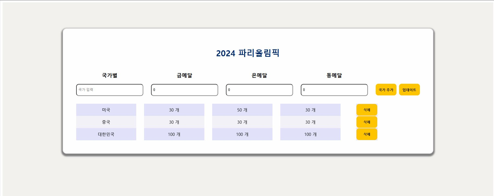

<h2>🏅React 파리올림픽 메달 집계 프로그램🏅</h2>
React를 이용하여 각 국가의 메달 수를 입력하여 집계해주는 프로그램 입니다.


---


## 📺프로젝트 설명
각 국가의 메달 수를 종합하여 직관적으로 데이터를 입력해 확인할 수 있는 기능을 제공하며, CRUD 방식을 활용해 간단하고 효율적으로 조작하실 수 있습니다.


---

## 🖼️스크린샷



---


## 🌟프로젝트 구조 및 기능

```plaintext
Medal_Statistics/
├── LICENSE
├── README.md
├── medal_total/
│   ├── index.html
│   ├── public/
│   │   ├── video/
│   │   └── screenshot1.jpg
│   └── src/
│       ├── assets/
│       ├── components/
│       │   ├── Button.jsx
│       │   ├── InputBox.jsx
│       │   └── ResultTable.jsx
│       ├── App.css
│       ├── App.jsx
│       ├── index.css
│       └── main.jsx
```


---
## ⚙️설치 방법

#### ▶️프로젝트 클론 : git clone https://github.com/noodlewd/2nd.Personal-assignment.git
                                          
#### 🔽폴더 이동 : cd medal_total (이중폴더로 인해 하위 폴더로 이동해야 합니다.)
                                          
#### 🔽의존성 설치 : yarn install
                                          
#### ◀️개발 서버 시작 : yarn dev

## ✏️사용 방법 : 브라우저에서 로컬환경으로 실행하여 프로그램을 이용하실 수 있습니다.


---


## 🛠️기술 스택
- **프론트엔드**: React, Vite, CSS
- **개발 도구**: Visual Studio Code, Git


---


## 👨🏻‍🏫기능설명

### 1️⃣. 국가 추가 기능
 - 사용자가 국가이름과 메달의 갯수들을 입력해 준 뒤 국가 추가 버튼을 클릭 시 테이블에 데이터가 생성됩니다.

### 2️⃣. 업데이트 기능
 - 사용자가 동일한 국가이름과 향후 추가 된 메달 갯수를 입력해 준 뒤 업데이트 버튼을 클릭 시 테이블에 데이터가 합산되어 적용됩니다.

### 3️⃣. 삭제 기능
 - 사용자가 정보를 잘못 입력하여 테이블에 데이터가 옳지 않을 경우 우측의 삭제 버튼을 클릭 하여 해당 데이터를 지울 수 있습니다.


---

## 👨‍💻개발 인원
- 김동우(프론트엔드)


---


## ✅추가 계획
- UI 수정
- 내림차순 데이터 정렬 방식 추가
- 로컬 스토리지 활용으로 인한 데이터 값 유지
- 빈 항목에 메달 별 점수를 지정하여 국가별 순위를 선정하는 UI 구현

